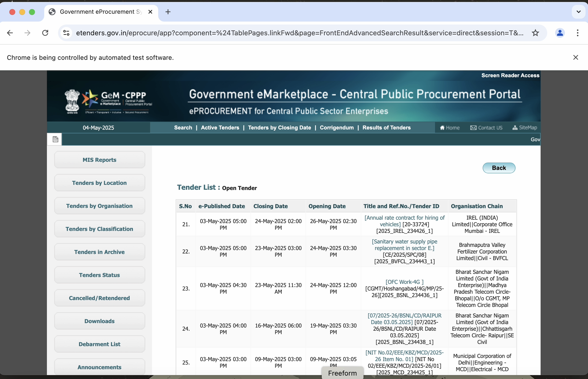

# TenderX

TenderX is an automated tender scraping and management system that fetches open tenders from the Government eProcurement portal, downloads associated documents, uploads them to cloud storage, and displays metadata via a simple UI.

## Features

### Web Scraping  
- Scrapes open tenders with support for pagination (21+ pages).  
- Handles CAPTCHA using OCR (Tesseract).  
- Downloads ZIP files containing tender documents.

### Cloud Storage & Metadata  
- Uploads documents to AWS S3 with public URLs.  
- Saves tender metadata (ID, document URL, etc.) to a PostgreSQL database.

### Deployment & Scheduling  
- Can be deployed to platforms like AWS EC2 or Heroku.  
- Supports periodic scraping using cron jobs.  
- Secures API keys and credentials using environment variables.
  
## Screenshots

### 1. Government Portal - List of Tenders  
  

### 2. AWS S3 Bucket - Uploaded Tender Documents  
  

### 3. React UI - Displaying Tender Metadata  
  

## Demo Video  

## Tech Stack  
- Python, Selenium, Tesseract OCR
- React JS 
- AWS S3, PostgreSQL (Supabase)  
- Flask (UI), Cron, Docker 

## Note  
This project was developed as part of an engineering assignment. It focuses on building an extensible and maintainable scraping pipeline with robust exception handling.

